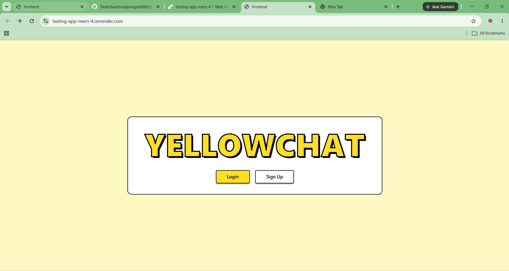
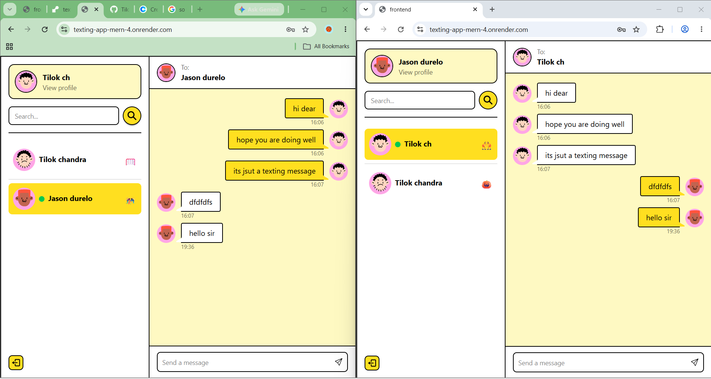
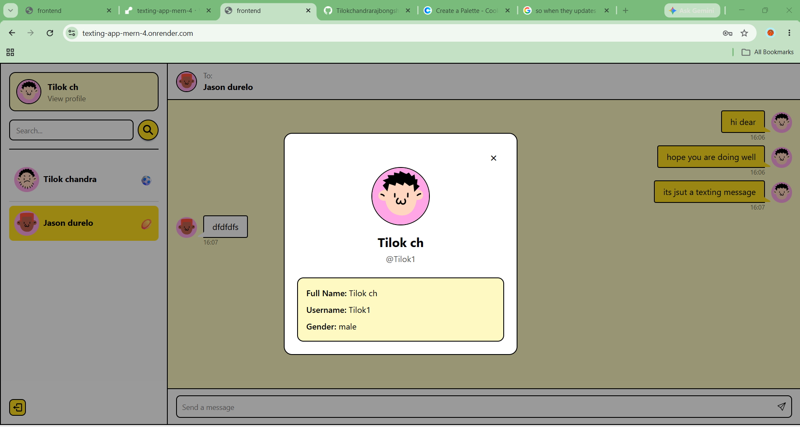
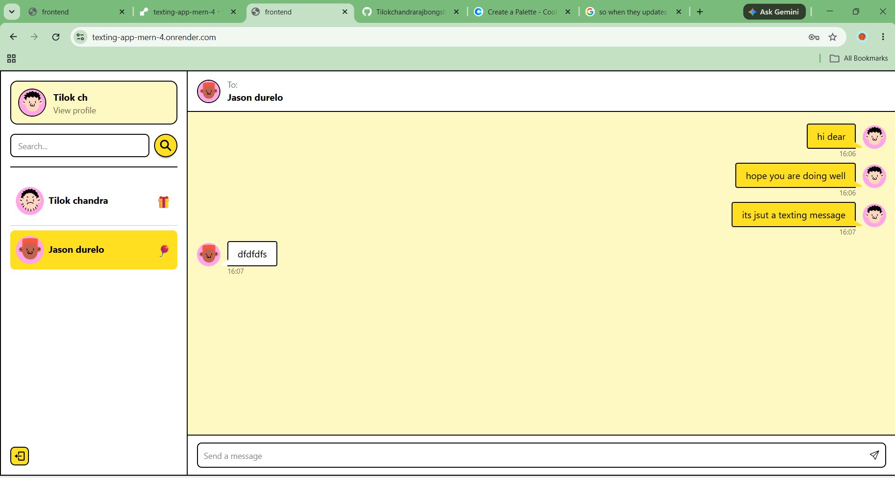
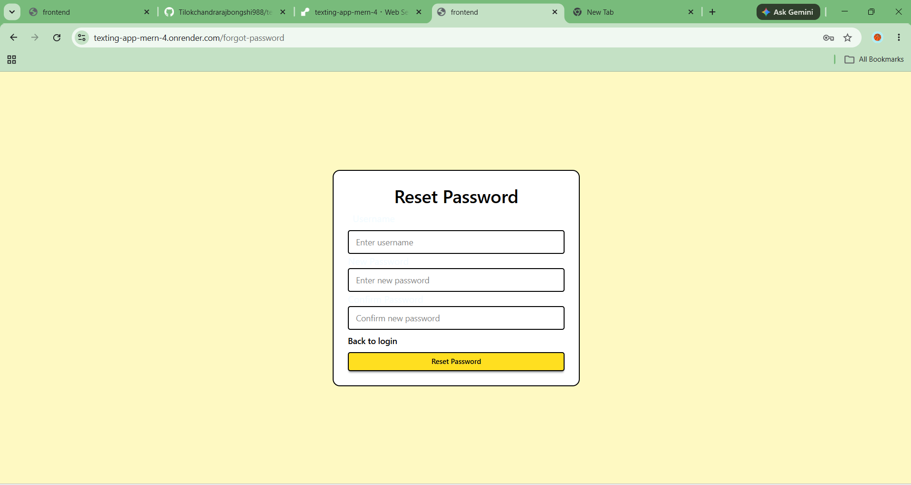

# YellowChat

A full-stack MERN chat application where users can create an account, log in, see available users, check who is online, and exchange private messages in real time.

The app is live online, so real-time messaging can be tested from two browser windows or two different devices. When one user sends a message, the other user receives it instantly through Socket.IO without refreshing the page.

## Live Demo

[View Live App](https://texting-app-mern-4.onrender.com/)

Demo login:

```txt
Username: demo1
Password: Demo12345
```

Note: This app is hosted on Render's free plan, so the first load may take a few seconds if the server was inactive.

## Screenshots

### Landing Page


### Chat In Two Browser Windows


### User Profile Modal


### Chat Screen


### Reset Password


## Project Summary

This project demonstrates a complete private messaging workflow. A user signs up or logs in, the backend creates a JWT cookie, protected routes load other users and conversations, and Socket.IO keeps both sides connected for live message delivery.

The chat interface separates sent and received messages visually, shows online users in the sidebar, plays a notification sound for incoming messages, and automatically scrolls to the latest message.

## Features

- Simple YellowChat landing page with login and signup buttons
- User signup, login, and logout
- Beginner-friendly reset password using username and new password
- JWT authentication stored in HTTP cookies
- Protected backend routes for users and messages
- Private one-to-one conversations
- Real-time message delivery with Socket.IO
- Online user tracking with live sidebar status
- Search users by name
- User profile modal with avatar, full name, username, and gender
- Sent messages shown on the right and received messages shown on the left
- Different message bubble colors for sender and receiver
- Yellow themed chat interface with bold black borders
- Incoming message shake animation
- Message sound notification
- Auto-scroll to the latest message
- Random profile avatars generated during signup
- Toast messages for validation and API feedback
- Responsive React chat UI
- MongoDB storage for users, conversations, and messages
- Production deployment setup for Render

## Tech Stack

### Frontend

- React
- Vite
- React Router
- Zustand
- Socket.IO Client
- Tailwind CSS
- DaisyUI
- React Hot Toast
- React Icons

### Backend

- Node.js
- Express.js
- MongoDB
- Mongoose
- Socket.IO
- JWT
- Cookie Parser
- bcrypt

## Project Structure

```txt
Chatapplicationproject/
|-- backend/
|   |-- controllers/
|   |-- db/
|   |-- middleware/
|   |-- models/
|   |-- routes/
|   |-- socket/
|   |-- utils/
|   `-- server.js
|-- frontend/
|   |-- public/
|   |-- src/
|   |   |-- assets/
|   |   |-- components/
|   |   |-- context/
|   |   |-- pages/
|   |   |-- utils/
|   |   `-- zustand/
|   `-- vite.config.js
|-- screenshots/
|-- package.json
`-- README.md
```

## Environment Variables

Create a `.env` file in the project root.

```env
MONGO_DB_URI=your_mongodb_connection_string
JWT_SECRET=your_jwt_secret
PORT=5000
NODE_ENV=development
```

Do not push your `.env` file to GitHub.

## Run Locally

### 1. Install backend dependencies

```bash
npm install
```

### 2. Install frontend dependencies

```bash
npm install --prefix frontend
```

### 3. Start the backend

```bash
npm run server
```

The backend runs on:

```txt
http://localhost:5000
```

### 4. Start the frontend

Open another terminal and run:

```bash
npm run dev --prefix frontend
```

The frontend runs on:

```txt
http://localhost:5173
```

If PowerShell blocks `npm`, run the same commands with `npm.cmd`.

## API Routes

### Auth

```txt
POST /api/auth/signup
POST /api/auth/login
POST /api/auth/logout
```

### Users

```txt
GET /api/users
```

### Messages

```txt
GET  /api/messages/:id
POST /api/messages/send/:id
```

## How It Works

1. A user signs up or logs in.
2. The backend hashes passwords with bcrypt and creates a JWT cookie.
3. Protected routes verify the cookie before returning users or messages.
4. The frontend connects to Socket.IO with the logged-in user's ID.
5. The server stores each connected user's socket ID.
6. When a message is sent, it is saved in MongoDB.
7. If the receiver is online, Socket.IO emits the message directly to that user.
8. The receiver sees the new message instantly with a notification sound.

## Deployment

This project is configured so the Express backend can serve the production React build.

For Render, use:

### Build Command

```bash
npm run build
```

### Start Command

```bash
npm start
```

Add these environment variables in Render:

```txt
MONGO_DB_URI
JWT_SECRET
NODE_ENV=production
```

Render automatically provides the `PORT`.

## Future Improvements

- Add typing indicators
- Add message seen/read status
- Add image and file sharing
- Add group chats
- Add user profile editing
- Add password reset
- Improve mobile layout

## Author

Created by Tilok.
